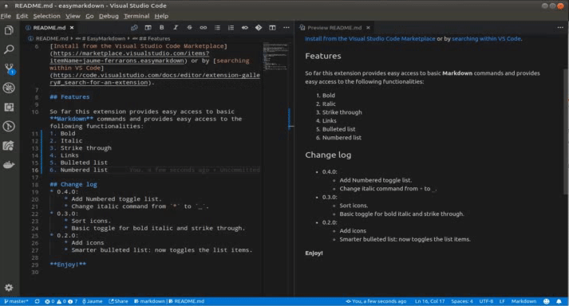

# EasyMarkdown

This extension provides a GUI to easily edit **Markdown**, specially useful for those less versed on this language.

## Installation
[Install from the Visual Studio Code Marketplace](https://marketplace.visualstudio.com/items?itemName=jaume-ferrarons.easymarkdown) or by [searching within VS Code](https://code.visualstudio.com/docs/editor/extension-gallery#_search-for-an-extension).

## Features

So far this extension provides easy access to basic **Markdown** commands and provides easy access to the following functionalities:
* **Bold**
* _Italic_
* ~~Strike through~~
* [Links](https://marketplace.visualstudio.com/items?itemName=jaume-ferrarons.easymarkdown)
* Bulleted list
* Numbered list
* Tables

## Change log
* 0.6.0:
    * Convert selection to table.
* 0.4.0:
    * Add Numbered toggle list.
    * Change italic command from `*` to `_`.
* 0.3.0:
    * Sort icons.
    * Basic toggle for bold italic and strike through.
* 0.2.0:
    * Add icons
    * Smarter bulleted list: now toggles the list items.

**Enjoy!**
